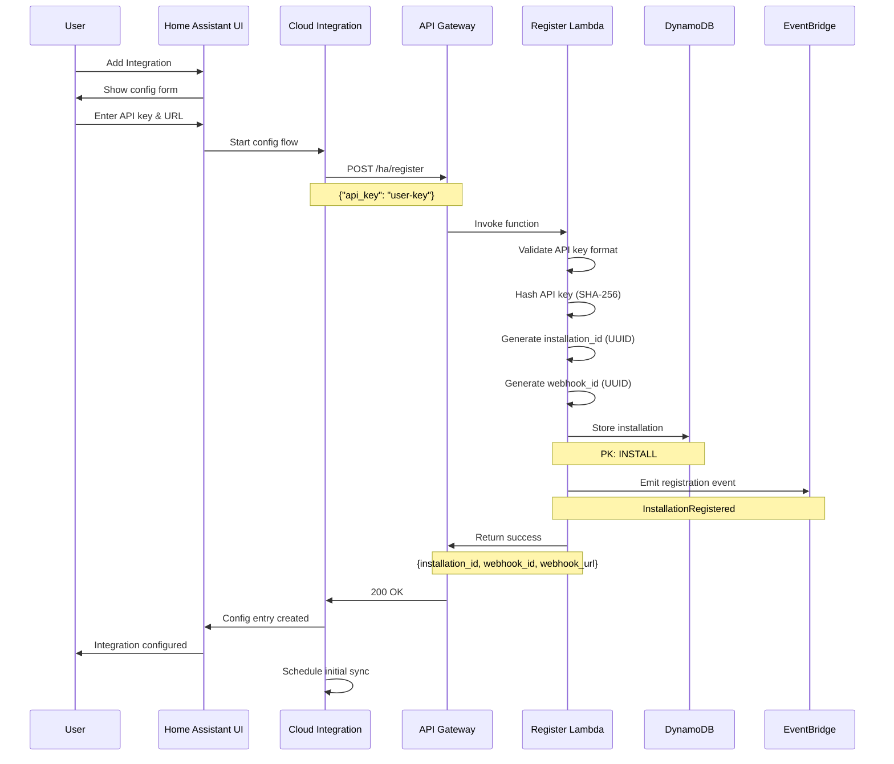
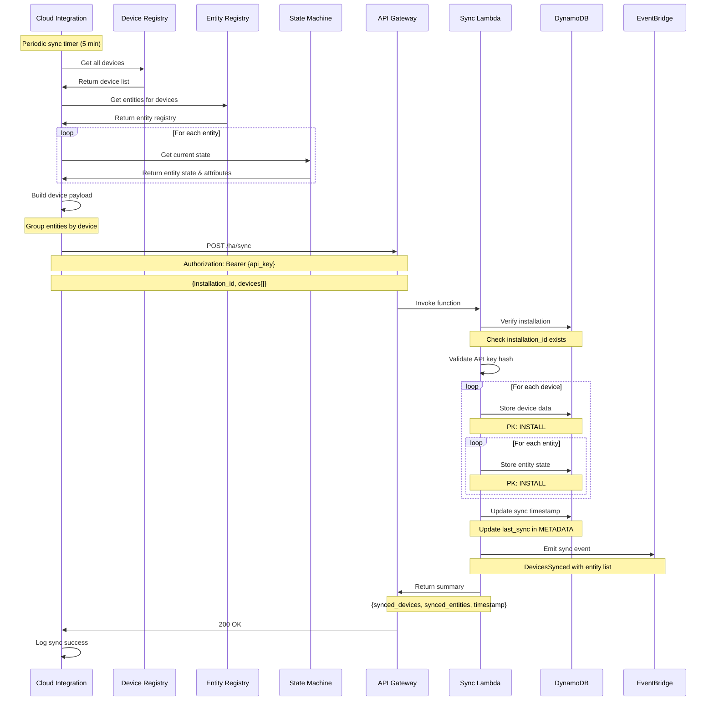
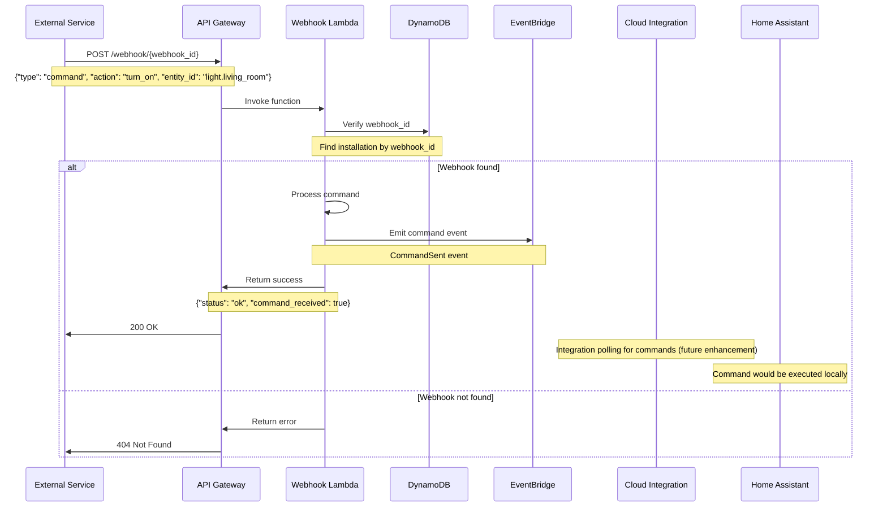
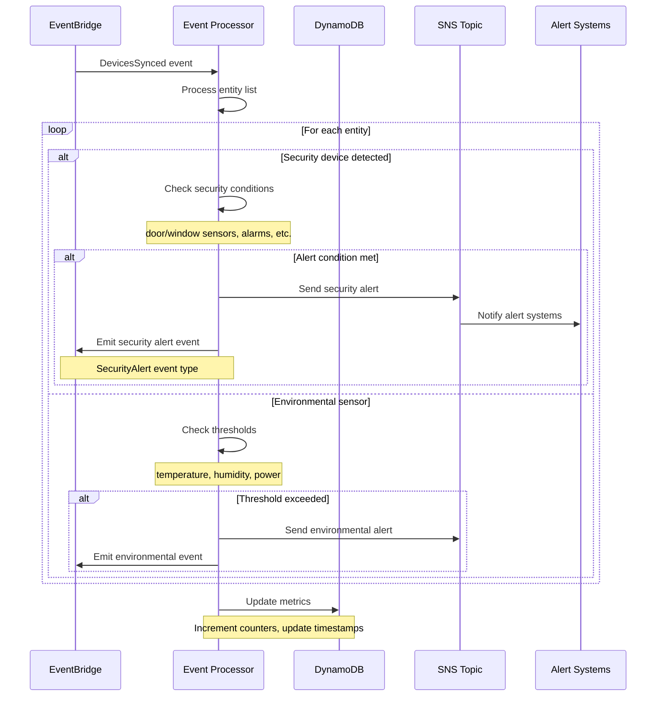
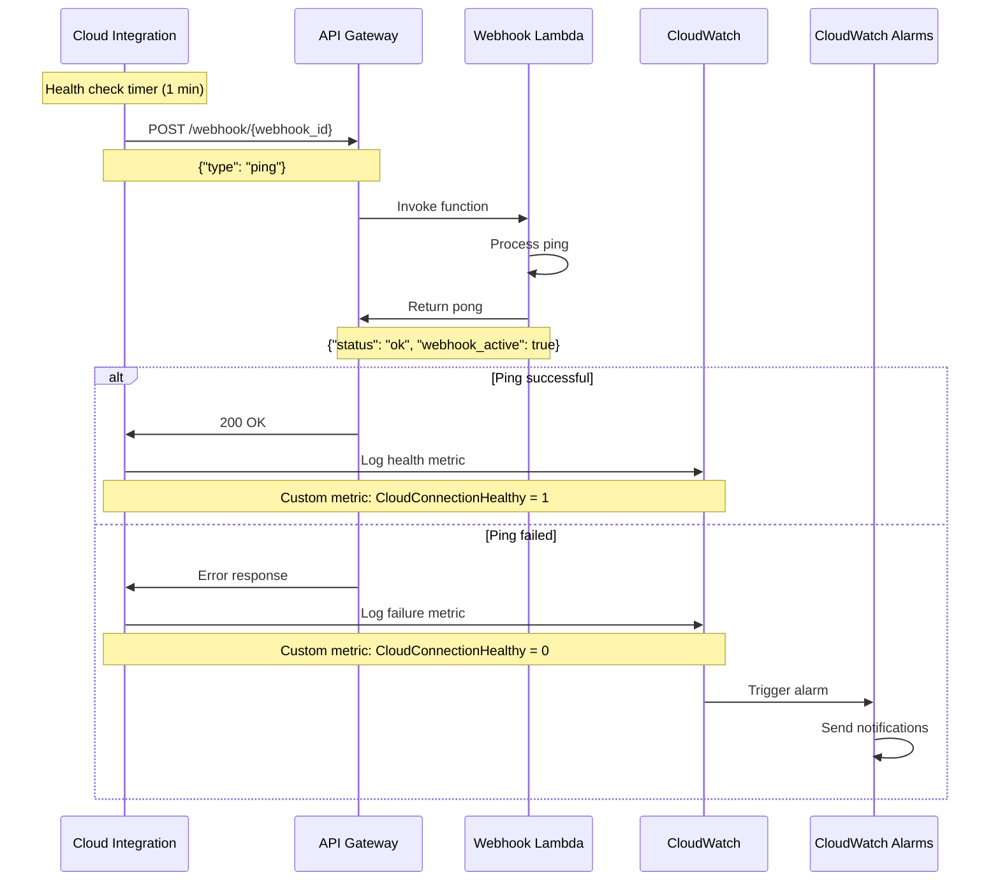
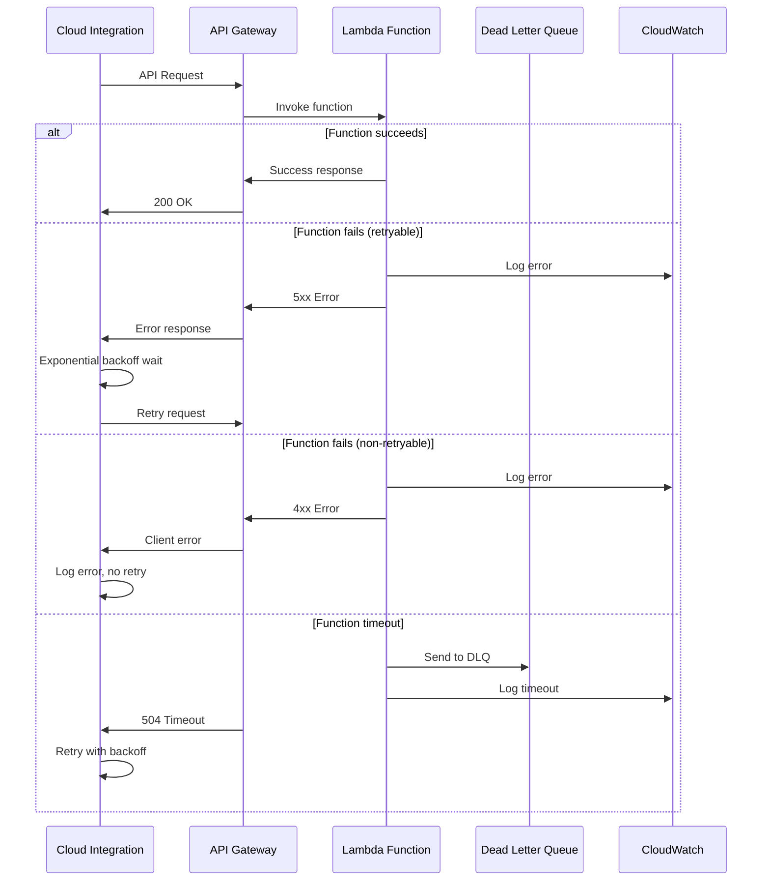
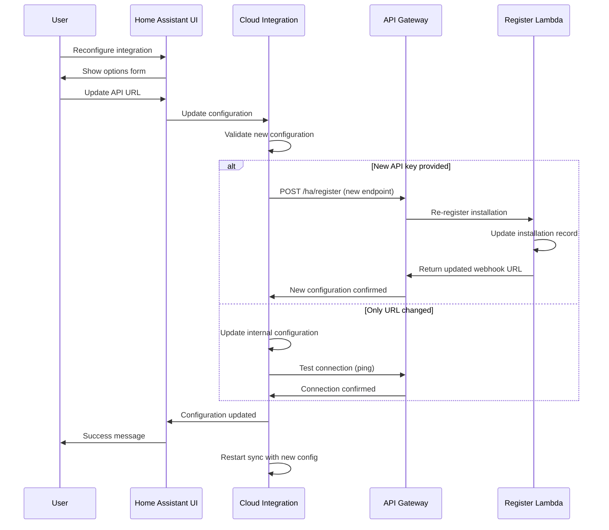
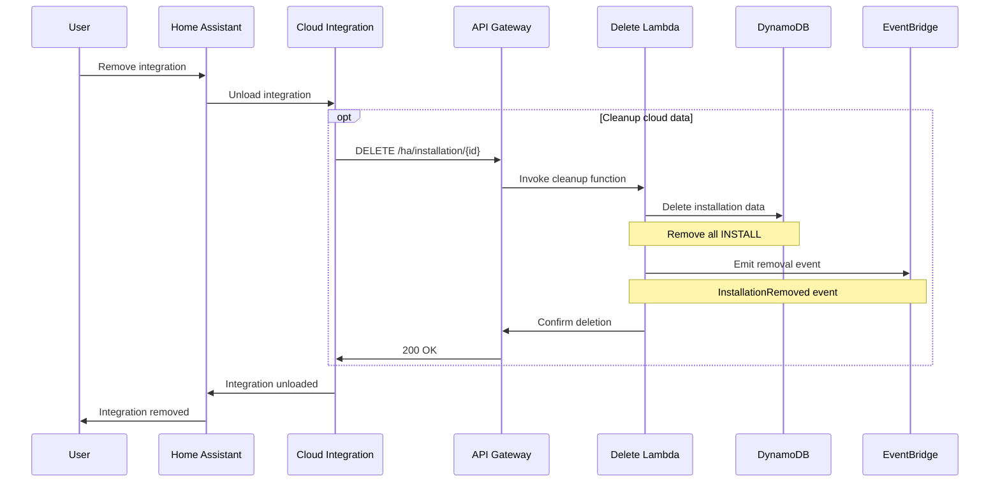
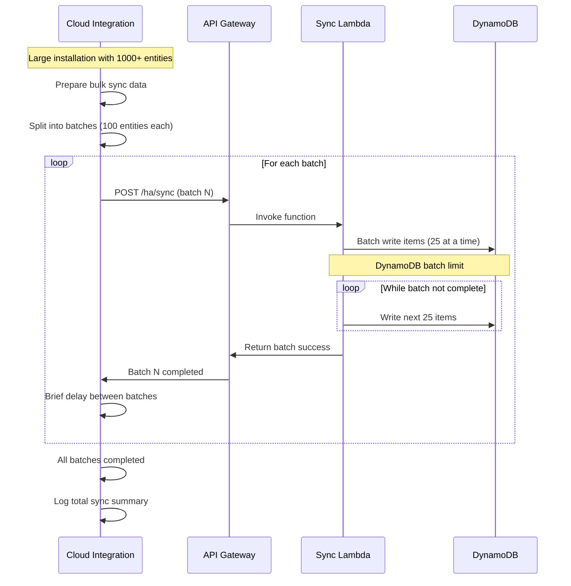

# Home Assistant Cloud Integration - Sequence Diagrams

This document contains detailed sequence diagrams for the major flows in the Home Assistant Cloud Integration system.

## 1. Installation Registration Flow

## 2. Device Synchronization Flow

## 3. Command Execution Flow (Cloud to Home Assistant)

## 4. Status Update Flow (Home Assistant to Cloud)

```mermaid
sequenceDiagram
    participant HA as Home Assistant
    participant INT as Cloud Integration
    participant API as API Gateway
    participant WH as Webhook Lambda
    participant DB as DynamoDB
    participant EB as EventBridge

    Note over HA: Entity state changes
    HA->>INT: State change event
    INT->>INT: Check if entity should sync
    
    alt Entity in sync list
        INT->>INT: Prepare status update
        
        INT->>API: POST /webhook/{webhook_id}
        Note over INT,API: {"type": "status", "entities": [...]}
        
        API->>WH: Invoke function
        WH->>DB: Verify webhook_id
        
        WH->>WH: Process status update
        WH->>EB: Emit status event
        Note over WH,EB: StatusUpdate event
        
        WH->>API: Return acknowledgment
        API->>INT: 200 OK
        INT->>INT: Log status update sent
        
    else Entity not in sync list
        INT->>INT: Ignore change
    end
```

## 5. Event Processing and Automation Flow

## 6. Health Check and Monitoring Flow

## 7. Error Handling and Retry Flow

## 8. Configuration Update Flow

## 9. Installation Removal Flow

## 10. Bulk Operations Flow

## Error Scenarios and Recovery

### Authentication Failures
- Invalid API key → Return 401, trigger re-authentication flow
- Expired installation → Return 403, trigger re-registration
- Missing webhook → Return 404, log error for investigation

### Network and Service Failures
- API Gateway timeout → Retry with exponential backoff
- DynamoDB throttling → Retry with jitter and backoff
- Lambda cold start → Accept higher initial latency

### Data Consistency Issues
- Partial sync failure → Resume from last successful batch
- State drift → Trigger full re-sync on next cycle
- Webhook delivery failure → Queue for retry with DLQ

These sequence diagrams provide a comprehensive view of all major flows within the Home Assistant Cloud Integration system, including normal operations, error conditions, and recovery scenarios.