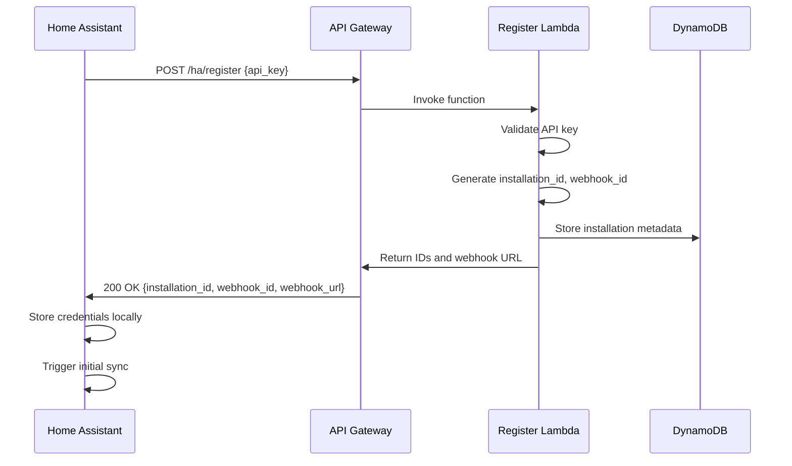
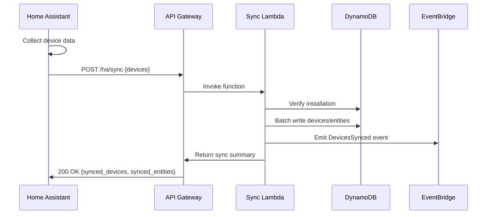
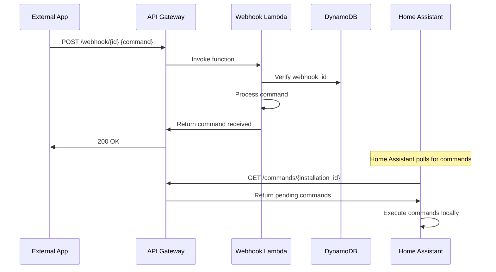

# Home Assistant Cloud Integration Specification

## Overview

This document specifies the architecture, data flows, and implementation details for the Home Assistant Cloud Integration. The integration enables secure, bidirectional communication between Home Assistant instances and a cloud backend infrastructure hosted on AWS.

## Goals and Objectives

### Primary Goals
- **Secure Cloud Sync**: Synchronize Home Assistant devices and entities to a cloud backend
- **Remote Control**: Enable device control from anywhere through cloud webhooks
- **Real-time Updates**: Provide instant bidirectional state synchronization
- **Scalability**: Support multiple Home Assistant installations from a single backend
- **Security**: Implement end-to-end encryption and authentication

### Non-Goals
- **Real-time Video Streaming**: Not designed for high-bandwidth media streaming
- **Local Network Replacement**: Should complement, not replace, local Home Assistant functionality
- **Public Device Discovery**: No public device registry or sharing features

## Architecture Overview

### High-Level Architecture

```
┌─────────────────────┐    ┌─────────────────────┐    ┌─────────────────────┐
│ Home Assistant      │    │ AWS Cloud Backend   │    │ External Services   │
│                     │    │                     │    │                     │
│ ┌─────────────────┐ │    │ ┌─────────────────┐ │    │ ┌─────────────────┐ │
│ │ Cloud           │ │    │ │ API Gateway     │ │    │ │ Mobile Apps     │ │
│ │ Integration     │ │◄──►│ │                 │ │◄──►│ │                 │ │
│ │                 │ │    │ └─────────────────┘ │    │ └─────────────────┘ │
│ └─────────────────┘ │    │ ┌─────────────────┐ │    │ ┌─────────────────┐ │
│ ┌─────────────────┐ │    │ │ Lambda Functions│ │    │ │ Web Dashboard   │ │
│ │ Device Manager  │ │    │ │                 │ │    │ │                 │ │
│ │                 │ │    │ │ - Register      │ │    │ └─────────────────┘ │
│ └─────────────────┘ │    │ │ - Sync          │ │    │ ┌─────────────────┐ │
│ ┌─────────────────┐ │    │ │ - Webhook       │ │    │ │ Third-party     │ │
│ │ Entity Registry │ │    │ │ - Events        │ │    │ │ Integrations    │ │
│ │                 │ │    │ └─────────────────┘ │    │ │                 │ │
│ └─────────────────┘ │    │ ┌─────────────────┐ │    │ └─────────────────┘ │
└─────────────────────┘    │ │ DynamoDB        │ │    └─────────────────────┘
                           │ │                 │ │
                           │ │ - Installations │ │
                           │ │ - Devices       │ │
                           │ │ - Entities      │ │
                           │ └─────────────────┘ │
                           │ ┌─────────────────┐ │
                           │ │ EventBridge     │ │
                           │ │                 │ │
                           │ │ - Automation    │ │
                           │ │ - Monitoring    │ │
                           │ │ - Notifications │ │
                           │ └─────────────────┘ │
                           └─────────────────────┘
```

## Component Specifications

### 1. Home Assistant Integration

#### 1.1 Integration Structure

```
custom_components/your_cloud/
├── __init__.py          # Main integration setup and coordinator
├── config_flow.py       # Configuration UI flow
├── const.py            # Constants and configuration
├── manifest.json       # Integration metadata
└── strings.json        # Localization strings
```

#### 1.2 Configuration Flow

**Step 1: User Input**
- API Key (required)
- API URL (optional, defaults to production)
- Integration Name (optional)

**Step 2: Registration**
- Validate API key with backend
- Register installation and receive installation_id and webhook_url
- Store credentials securely

**Step 3: Initial Sync**
- Collect all supported entities
- Send initial device sync to cloud
- Set up periodic sync schedule

#### 1.3 Supported Entity Types

| Domain | Description | Sync Attributes |
|--------|-------------|-----------------|
| `light` | Light controls | state, brightness, color, effect |
| `switch` | Binary switches | state |
| `sensor` | Sensor readings | state, unit_of_measurement, device_class |
| `binary_sensor` | Binary sensors | state, device_class |
| `climate` | HVAC controls | temperature, target_temperature, mode |
| `fan` | Fan controls | state, speed, direction |
| `cover` | Window coverings | state, position |
| `lock` | Door locks | state |
| `alarm_control_panel` | Security systems | state, code_arm_required |

#### 1.4 Security Considerations

- API keys stored in Home Assistant's credential storage
- All communication over HTTPS/TLS
- Installation ID used for backend authorization
- No sensitive data (passwords, personal info) synced

### 2. AWS Cloud Backend

#### 2.1 Infrastructure Components

**API Gateway**
- RESTful API endpoints
- CORS configuration
- Request validation
- Rate limiting (optional)

**Lambda Functions**
- `register`: Handle installation registration
- `sync`: Process device synchronization
- `webhook`: Bidirectional communication
- `eventProcessor`: Process EventBridge events

**DynamoDB Table**
- Single table design with GSI
- On-demand billing
- Point-in-time recovery enabled
- Encryption at rest

**EventBridge**
- Custom event bus for HA events
- Event rules for automation
- Integration with notification services

#### 2.2 API Endpoints

**Registration Endpoint**
```http
POST /ha/register
Content-Type: application/json

{
  "api_key": "string"
}
```

**Response:**
```json
{
  "installation_id": "uuid",
  "webhook_id": "uuid",
  "webhook_url": "string"
}
```

**Sync Endpoint**
```http
POST /ha/sync
Authorization: Bearer {api_key}
Content-Type: application/json

{
  "installation_id": "uuid",
  "devices": [
    {
      "device_id": "string",
      "name": "string",
      "manufacturer": "string",
      "model": "string",
      "entities": [
        {
          "entity_id": "string",
          "name": "string",
          "device_class": "string",
          "state": "string",
          "attributes": {}
        }
      ]
    }
  ]
}
```

**Webhook Endpoint**
```http
POST /webhook/{webhook_id}
Content-Type: application/json

{
  "type": "command|status|ping",
  "action": "string",      // for commands
  "entity_id": "string",   // for commands
  "params": {},            // for commands
  "entities": []           // for status updates
}
```

#### 2.3 Data Model

**DynamoDB Table Schema**

| PK | SK | Attributes |
|----|----|----|
| `INSTALL#{installation_id}` | `METADATA` | api_key_hash, webhook_id, created_at, last_sync |
| `INSTALL#{installation_id}` | `DEVICE#{device_id}` | device_id, name, manufacturer, model, entities |
| `INSTALL#{installation_id}` | `ENTITY#{entity_id}` | entity_id, device_id, name, device_class, state, attributes |
| `INSTALL#{installation_id}` | `METRICS` | total_syncs, total_commands, last_command |

**GSI1 Schema (for cross-installation queries)**

| GSI1PK | GSI1SK | Purpose |
|--------|--------|---------|
| `ENTITY#{entity_id}` | `INSTALL#{installation_id}` | Find all installations with specific entity |
| `WEBHOOK#{webhook_id}` | `INSTALL#{installation_id}` | Webhook to installation mapping |

### 3. Data Flow Specifications

#### 3.1 Registration Flow



#### 3.2 Device Sync Flow



#### 3.3 Command Flow (Cloud → HA)



## Security Specifications

### 4.1 Authentication and Authorization

**API Key Management**
- API keys are 32+ character random strings
- Keys are hashed (SHA-256) before storage in DynamoDB
- Keys are transmitted in Authorization header: `Bearer {api_key}`
- Key rotation supported through re-registration

**Installation Authorization**
- Each installation has unique installation_id
- Webhook access controlled by webhook_id (UUID v4)
- Cross-installation access prevented by access patterns

### 4.2 Data Protection

**Encryption in Transit**
- All API endpoints use HTTPS/TLS 1.2+
- Certificate validation required

**Encryption at Rest**
- DynamoDB encryption using AWS managed keys
- CloudWatch logs encrypted
- Lambda environment variables encrypted

**Data Minimization**
- Only necessary entity attributes synced
- Personal data (names, locations) filtered out
- Device identifiers anonymized where possible

### 4.3 Network Security

**CORS Configuration**
- Specific origin allowlisting for web applications
- Credentials not included in CORS requests

**Rate Limiting** (Optional)
- API Gateway usage plans
- Per-installation rate limiting
- Burst and sustained rate limits

## Event Specifications

### 5.1 EventBridge Events

**Event Types**

1. **InstallationRegistered**
```json
{
  "source": "homeassistant.integration",
  "detail-type": "InstallationRegistered",
  "detail": {
    "installation_id": "uuid",
    "timestamp": "ISO-8601"
  }
}
```

2. **DevicesSynced**
```json
{
  "source": "homeassistant.integration", 
  "detail-type": "DevicesSynced",
  "detail": {
    "installation_id": "uuid",
    "device_count": 5,
    "entity_count": 23,
    "entities": [
      {
        "entity_id": "light.living_room",
        "state": "on",
        "device_id": "device-1"
      }
    ],
    "timestamp": "ISO-8601"
  }
}
```

3. **CommandSent**
```json
{
  "source": "homeassistant.integration",
  "detail-type": "CommandSent", 
  "detail": {
    "installation_id": "uuid",
    "action": "turn_on",
    "entity_id": "light.living_room",
    "params": {"brightness": 255},
    "timestamp": "ISO-8601"
  }
}
```

### 5.2 Automation Triggers

**Security Alerts**
- Door/window sensors opening
- Motion detection
- Alarm system triggers
- Lock state changes

**Environmental Monitoring**
- Temperature extremes
- Humidity levels
- Air quality alerts
- Power consumption spikes

**System Health**
- Sync failures
- Connection timeouts
- Authentication failures
- Service degradation

## Performance Specifications

### 6.1 Latency Requirements

| Operation | Target Latency | Maximum Latency |
|-----------|----------------|------------------|
| Registration | < 2 seconds | < 5 seconds |
| Device Sync | < 5 seconds | < 15 seconds |
| Webhook Command | < 1 second | < 3 seconds |
| Status Update | < 2 seconds | < 5 seconds |

### 6.2 Throughput Requirements

| Metric | Target | Peak |
|--------|--------|------|
| Concurrent Installations | 1,000 | 10,000 |
| Syncs per minute | 100 | 1,000 |
| Webhook calls per second | 10 | 100 |
| Entity updates per second | 100 | 1,000 |

### 6.3 Scalability Considerations

**Lambda Scaling**
- Concurrent execution limits
- Cold start optimization
- Memory allocation tuning

**DynamoDB Scaling**
- On-demand billing mode
- Auto-scaling for provisioned capacity
- Hot partition monitoring

**API Gateway Scaling**
- Built-in scaling (10,000 RPS default)
- Usage plan quotas
- Caching strategies

## Error Handling Specifications

### 7.1 Error Categories

**Client Errors (4xx)**
- 400: Invalid request format
- 401: Invalid API key
- 403: Installation not found
- 404: Webhook not found
- 429: Rate limit exceeded

**Server Errors (5xx)**
- 500: Internal server error
- 502: Backend service unavailable
- 503: Service temporarily unavailable
- 504: Gateway timeout

### 7.2 Retry Logic

**Home Assistant Integration**
- Exponential backoff for API calls
- Maximum 3 retry attempts
- Circuit breaker for repeated failures
- Graceful degradation (local-only mode)

**Lambda Functions**
- DLQ for failed events
- Automatic retry with backoff
- Error logging to CloudWatch
- Metric emission for monitoring

### 7.3 Monitoring and Alerting

**CloudWatch Metrics**
- Function duration and errors
- DynamoDB throttling
- API Gateway response codes
- Custom business metrics

**CloudWatch Alarms**
- Error rate thresholds
- Latency percentiles
- DynamoDB capacity utilization
- Lambda concurrent executions

## Testing Specifications

### 8.1 Unit Testing

**Home Assistant Integration**
- Mock HTTP responses
- Configuration flow testing
- Entity state handling
- Error condition testing

**Lambda Functions**
- Mocked AWS service calls
- Input validation testing
- Business logic verification
- Error handling validation

### 8.2 Integration Testing

**End-to-End Flows**
- Registration and initial sync
- Device state synchronization
- Command execution
- Error scenarios

**Performance Testing**
- Load testing with multiple installations
- Stress testing sync operations
- Latency measurement
- Resource utilization monitoring

### 8.3 Security Testing

**Authentication Testing**
- Invalid API key handling
- Token expiration
- Authorization bypass attempts

**Input Validation**
- SQL injection (DynamoDB NoSQL)
- XSS prevention
- Input size limits
- Malformed JSON handling

## Deployment Specifications

### 9.1 Environment Strategy

**Development Environment**
- Personal AWS accounts
- Relaxed security policies
- Debug logging enabled
- Cost optimization disabled

**Staging Environment**
- Production-like configuration
- Security policies enforced
- Performance testing enabled
- Limited access controls

**Production Environment**
- Full security implementation
- Monitoring and alerting
- Backup and recovery
- Multi-region deployment (future)

### 9.2 Infrastructure as Code

**Serverless Framework**
- Environment-specific configurations
- Parameter management
- Resource tagging
- Output values for integration

**AWS CloudFormation**
- Stack dependencies
- Resource naming conventions
- IAM role definitions
- Monitoring resources

### 9.3 CI/CD Pipeline

**Source Control**
- Feature branch workflow
- Pull request reviews
- Automated testing
- Security scanning

**Deployment Pipeline**
- Automated testing on commit
- Staging deployment on merge
- Production deployment on release
- Rollback capabilities

## Compliance and Legal

### 10.1 Data Privacy

**GDPR Compliance**
- User consent for data collection
- Right to data deletion
- Data portability support
- Privacy by design

**Data Retention**
- Entity state history limits
- Log retention policies
- Backup retention periods
- Data deletion procedures

### 10.2 Service Terms

**Usage Limitations**
- Fair use policies
- Rate limiting enforcement
- Resource consumption limits
- Abuse prevention

**Service Level Agreement**
- Availability targets (99.5%)
- Support response times
- Maintenance windows
- Incident communication

## Future Enhancements

### 11.1 Planned Features

**Enhanced Security**
- OAuth 2.0 integration
- Multi-factor authentication
- Device certificates
- End-to-end encryption

**Advanced Analytics**
- Usage dashboards
- Performance insights
- Predictive analytics
- Cost optimization recommendations

**Integration Ecosystem**
- Third-party API support
- Webhook forwarding
- Custom automation rules
- Mobile application SDK

### 11.2 Scalability Roadmap

**Global Distribution**
- Multi-region deployment
- Data replication strategies
- Edge computing support
- CDN integration

**Advanced Architecture**
- Microservices decomposition
- Message queue integration
- Stream processing
- Real-time analytics

This specification serves as the definitive guide for implementing and maintaining the Home Assistant Cloud Integration system.